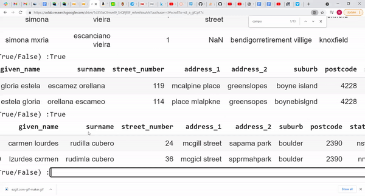

deepRL.py
========
This repo contains an implementation of a deep entity resolution algorithm inspired by the paper `Low-resource Deep Entity Resolution with Transfer and Active Learning <https://arxiv.org/pdf/1906.08042.pdf>`__ along with a demonstration in an .ipynb notebook. It deviates from the paper in several ways. This is because the code was written during a research assistant position at `The Policy Lab - Brown University <https://thepolicylab.brown.edu/>`_ so the code is adapted for our specific use case. The main differences are as follows.

* The fastText model is trained on the datasets provided when the class is initialized (as opposed to using pre-trained fastText vectors) and the size of the fastText vectors are customizable. 

* The deepRL class allows the user to build the network with either:

  #.  one single BiGRU - both datasets to be matched are passed into the same BiGRU and the absolute difference of the output vectors for each column is computed 
  #.  two separate BiGRUs - one for each dataset to be matched. The absolute difference of the output vectors for each column is computed

* Highway connections are not used

Dependencies
============
Language  

* Python 3.6.9

Packages  

* tensorflow 2.6.0
* keras 2.6.0
* gensim 3.6.0
* sklearn 0.22.2.post1
* tqdm 4.62.0
* numpy 1.19.5
* pandas 1.1.5

High Level Summary of Model
============

The paper linked above provides lots of detail about the algorithm, however the basic concept is as follows. One of the main issues that arises when working on entity resolution is the fact that, generally speaking in real world scenarios, limit labeled data is available to train a model. To handle this issue the author proposes a transfer learning approach where the network is initially trained on a 'source' dataset with abundant match/non-match labels. These weights and biases are then transferred over to be used with the 'target' dataset where the labels are not known. In order for this to work the paper proposes an adversarial architecture using a gradient reversal layer during training to achieve dataset-independent internal representations. If the classifier is performing well on the source dataset and the internal representations are indistinguishable between source and target dataset than we have reason to believe the model will perform reasonably on the target dataset. Please see `this <http://proceedings.mlr.press/v37/ganin15.html>`_ paper for more details on the adversarial approach. We then predict on the target dataset and pick the highest confidence match and non-match pairs (P(match) closest to 1 and 0 respectively), we automatically label them and add them to the training set. We also pull out the lowest confidence pairs (P(match) closest to 0.5) and we label these by hand. At each iteration we continue to fine tune the model and continue to increase the size of the labeled target dataset. The steps to use the deepRL class are as follows. 

How Does It Work?
=============
There are several different workflows that could be implemented using deepRL. Here we will outline how each method works and the user can customize their process for the specific task. The first step after preprocessing is to initialize the deepRL class. The class takes the following parameters: 

  Parameters
    df_org_source : dataframe
    	first of two fully labeled source datasets
    df_dup_source : dataframe
    	second of two fully labeled source datasets
    y_source : list 
    	labels for the matching status of pairs in candidate_pairs_source
    candidate_pairs_source : pd.MultiIndex
    	pd.MultiIndex object of pairs to be compared from df_org_source and df_dup_source
    df_org_target : dataframe
    	first of two target dataframes
    df_dup_target : dataframe
    	second of two target dataframes
    candidate_pairs_target : pd.MultiIndex
    	pd.MultiIndex object of pairs to be compared from the target datasets
    vec_length : int
    	dimension of fastText vectors to be trained with target and source data
    y_target : list, optional
    	list of labels for target data
    y_target_indices : list, optional
    	indices of labeled pairs- indices correspond with candidate_pairs_target
      
The code for this step might look like the following:

  .. code:: python

    import recordlinkage
    import pandas as pd
    from deepRL import DeepRL
    
    df_org_source = # source df1
    df_dup_source = # source df2
    y_source = # labels 
    
    # this is one option for producing the candidate pairs
    indexer = recordlinkage.Index()
    indexer.block(left_on='left_blocking_variable', right_on='right_blocking_variable')
    candidate_pairs_source = indexer.index(df_org_source, df_dup_source)
    
    df_org_target = # target df1
    df_dup_target = # target df2
    
    
    indexer = recordlinkage.Index()
    indexer.block(left_on='left_blocking_variable', right_on='right_blocking_variable')
    candidate_pairs_target = indexer.index(df_org_target, df_dup_target)
    
    vec_length = # the paper suggests 300 but this is up to the user
    y_target = # if any labels are known, this will help with the transfer learning but this argument is optional
    y_target_indices = # optional but required if y_target is passed as a argument
    
    # initialize the class
    DL = DeepRL(
       df_org_source, df_dup_source, y_source_true, candidate_pairs_source,
       df_org_target, df_dup_target, candidate_pairs_target, 50, y_target, y_target_indices
       )

The next step is to build the source model using the build_source_model() method. The class takes the following parameters:

  Parameters
    universal : bool, optional
        True means both both org and dup datasets are passed through a single BiGRU
        False means two separate BiGRUs are trained, one for org and one for dup
    summary : bool, optional
        bool to display model summary or not

  Return 
    None 
    
The code might look like the following:

  .. code:: python
  
    DL.build_source_model(universal=True, summary=True)
    
Next we train the source model with the source data. The class takes the following parameters:

  Parameters
    lr : float
        learning rate for model
    epochs : int
        number of epochs to train for
    batch_size : int
        batch_size for training

  Returns
    None 
    
The code might look like the following:

  .. code:: python
    
    DL.train_source_model(0.001, 10, 32)
    
During training, the user can observe the progress of the loss and accuracy for the match/non-match classifier similar to training a standard keras model. Also at the end of each epoch the val f1, precision and recall is printed out. After each time running the function, the learning rate, epochs and batch size can be adjusted and the training method can be rerun until the model converges. 

The next step is then to use transfer learning. First we have to build the model. The BiGRU and MLP layers of the model are taken from the source model and used in transfer learning. The output from the BiGRU is fed into the match/non-match MLP and also fed into a new MLP used to predict which dataset the observation came from. Also a gradient reversal layer is added between the BiGRU and the new MLP. The gradient reversal layer ensures that the dataset MLP is training to find differences in the internal representations (output of BiGRU) between the two datasets while the BiGRU is training to 'trick' the dataset MLP which will result in dataset independent internal representations. The build_adaptaion_model() method takes the following arguments:

  Parameters
    summary : bool
        determines whether or not the model summary is displayed
    
  Returns
    None
    
The code will look like the following:

    .. code:: python
    
      DL.build_adaptation_model(True)
      
Next we train the model. The train_adaptation_model() method takes the following arguments:

  Parameters
    lr : float
        learning rate
    epochs : int
        number of epochs for training
    batch_size : int
        batch size for training
    match_weight : float
        the weight for the match/non-match loss
        can be used to adjust weights if one classifier is "winning" over the other
    dataset_weight : float
        the weight for the source/target dataset loss
        can be used to adjust weights if one classifier is "winning" over the other

  Returns 
    None
    
The code might look like the following:

  .. code:: python
  
    DL.train_adaptation_model(0.001, 10, 32, 1.0, 0.3)
    
During training the user can observe the progress of the loss and accuracy for both the match/non-match classifier and the dataset classifier similar to training a standard keras model. If the dataset classifier is getting very high accuracy it means that the output of the BiGRU is significantly different between the source and target datasets. If this is the case, the BiGRU is not learning dataset independent internal representations. This can be corrected by adjusting the weights for the classifiers (last 2 arguments). The hyperparameters can be adjusted if the results are poor and the method can then be rerun. 

After the user is satisfied with the performance of the adaptation model, we enter the active/self learning phase of the process. The target model must be constructed first because we will use it to predict on the unlabeled data. The BiGRU and match/non-match MLP layers from the adaptation model are used in the target model. The build_target_model() function takes the following arguments:

  Parameters
    transfer : bool
        if True use the layers from the adaptation model
        if False random initialization for weights and biases
    universal : bool, optional
        True means both both org and dup datasets are passed through a single BiGRU
        False means two separate BiGRUs are trained, one for org and one for dup
    summary : bool, optional
        determines whether or not model summary is displayed

  Returns
    None
    
The code might look like the following:    
    
  .. code:: python

    DL.build_target_model(transfer=True, universal=True, summary=False) 
  
After the final model is built the user can use the active learning method. This method can be used to increase the size of the labeled target data. The highest confidence pairs are automatically labeled and added to the labeled target data. The lowest confidence pairs are pulled out for clerical review. The parameters are as follows:

  Parameters
    n_certain_false : int
        the number of high confidence false pairs to automatically label and add to training set
        should be selected to preserve approximate class balance
    n_certain_true : int
        the number of high confidence true pairs to automatically label and add to training set
        should be selected to preserve approximate class balance
    n_uncertain : int
        the number of low confidence pairs to label by hand

  Returns 
    None

The parameters n_certain_false and n_certain_true should be chosen to approximately preserve the class balance. The code would look like the following: 

  .. code:: python

    DL.active_self_learning(1000, 100, 10)
  
Next we have to manually label the low confidence pairs using the clerical_review() method. This method takes no parameters. The code and the resulting review process would look like the following:

  .. code:: python

    DL.clerical_review()

  
After the clerical review process is complete, the user has several options. If enough labeled target data is available the user can train the target model exclusively on the target data. However it will often be the case that there is insufficient labeled target data to train the target model because deep learning models are notorious for requiring a large amount of data to result in high performance. If this is the case the user can continue to train the adaptation model. During adaptation training, the loss from the match/non-match classifier is ignored for pairs where the label is not known. As more and more labeled target data is available the adaptation model will progressively perform better on the target data. The amount of data that is necessary for training the target model will likely vary from case to case and should be determined by the user. It is important to note, however, that if the target model is trained too early, the model will likely have very poor performance. If this is the case and the model is used for self learning, the model will automatically add incorrectly labeled data to the labeled target dataset. This could be catastrophic for performance because the model will be training on incorrectly labeled data in subsequent iterations. 

The very last method is the train_target_model() method. This method takes the following parameters:

  Parameters 
    lr : float
        learning rate
    epochs : int
        number of epochs for training
    batch_size : int
        batch size
    
  Returns 
    None

The code to train the final model would look like this:

  .. code:: python

    train_target_model(0.0001, 1, 32)
    
A coded walk through of this process along with additional details are available in the .ipynb notebook in this repo.
